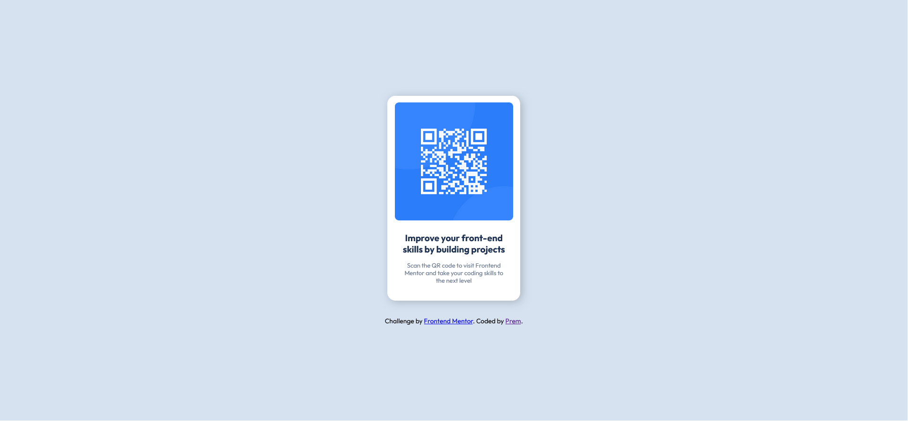
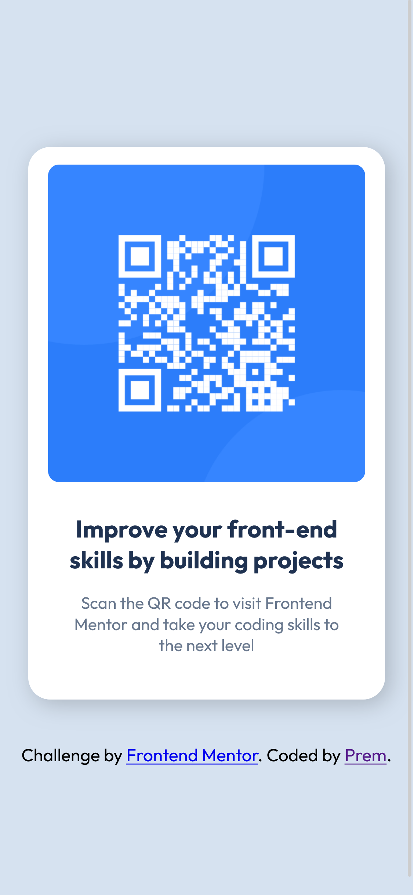

# Frontend Mentor - QR code component solution

This is a solution to the [QR code component challenge on Frontend Mentor](https://www.frontendmentor.io/challenges/qr-code-component-iux_sIO_H). Frontend Mentor challenges help you improve your coding skills by building realistic projects. 

## Table of contents

- [Overview](#overview)
  - [Screenshot](#screenshot)
  - [Links](#links)
- [My process](#my-process)
  - [Built with](#built-with)
  - [What I learned](#what-i-learned)
  - [Continued development](#continued-development)
  - [Useful resources](#useful-resources)
- [Author](#author)
- [Acknowledgments](#acknowledgments)

## Overvie

### Screenshot




### Links

- Solution URL: [GitHub Repo](https://github.com/prem-03829/QR-Code-Component)
- Live Site URL: [Add live site URL here](https://your-live-site-url.com)

## My process

### Built with

- Semantic HTML5 markup
- CSS custom properties
- Flexbox
- Google Fonts (Outfit)

### What I learned

- Using semantic elements like main, h1 and p
- Applying CSS variables to keep colors consistent
- Centering content using Flexbox
- Adding smooth hover effects and subtle shadows
- Matching a design more precisely by adjusting spacing and roundingely

```html
  <h1 class="title">
    Improve your front-end skills by building projects
  </h1>
```
```css
.container {
  border-radius: 20px;
  box-shadow: 4px 4px 20px rgba(0, 0, 0, 0.2);
}
```

### Continued development

I want to continue improving:
- Layout precision: matching designs more pixel-perfect
- Responsive behavior: using media queries more confidently
- Accessibility: improving alt text, roles, and structure
- Even small components like this are great practice for clean code habits.
- Writing cleaner, more scalable CSS

### Useful resources

- [HTML & CSS course](https://youtu.be/G3e-cpL7ofc?si=7YR5vK1qGlj99kkb) - A great beginner-friendly introduction to HTML and CSS. It helped reinforce core concepts I used in this challenge.


## Author

- LinkedIn - [Prem Paramanick](https://www.linkedin.com/in/prem-paramanick-a46205338)
- Frontend Mentor - [@prem-03829](https://www.frontendmentor.io/profile/prem-03829)
- GitHub - [@prem-03829](https://github.com/prem-03829)

## Acknowledgments

I came across Frontend Mentor while looking for ways to improve my frontend skills, and it turned out to be the perfect place to practice. The structured challenges helped me focus on real-world problems and sharpen my HTML and CSS fundamentals. This project is one of the first steps in that journey.